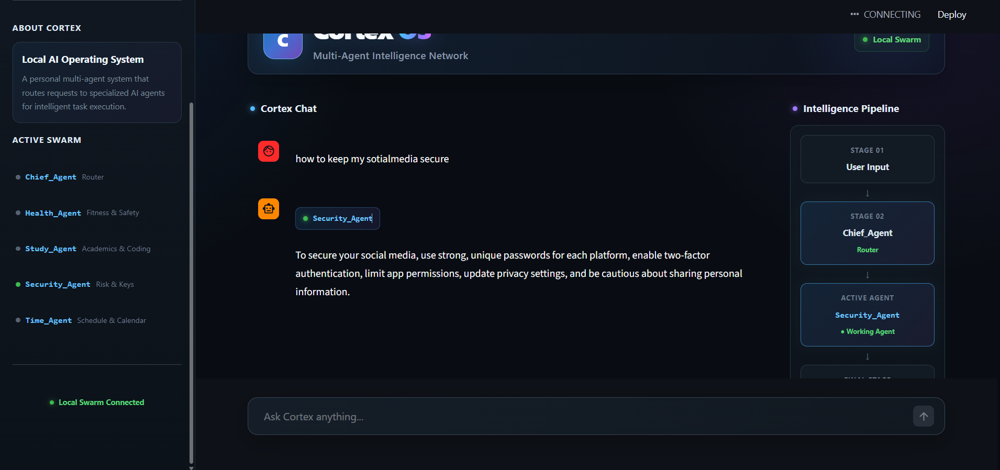
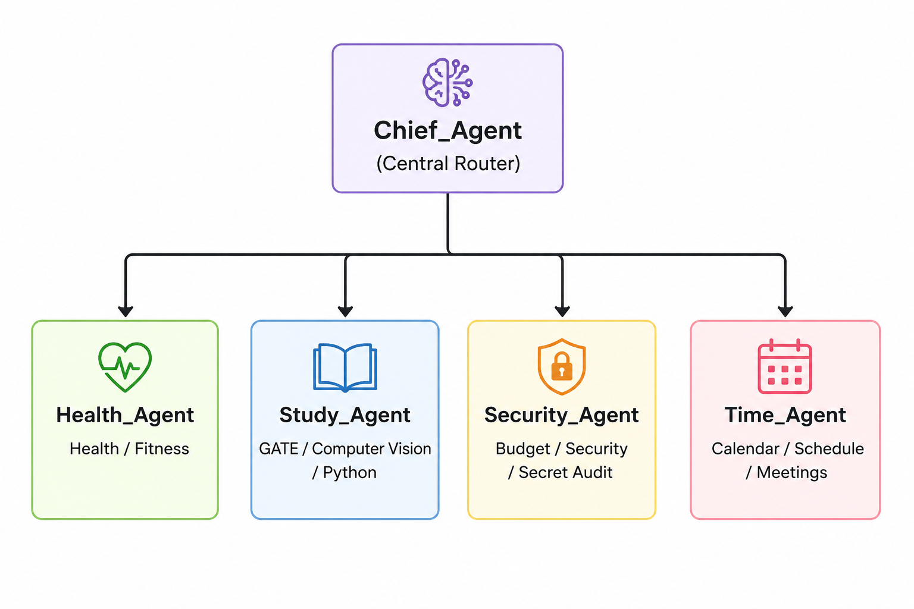

# Cortex Multi-Agent Core

Cortex is a localized, modular Python multi-agent system powered by **Google ADK** and **Ollama**.

The system uses a central **Chief_Agent** as an intelligent routing hub. It analyzes incoming user queries and transfers them to specialized agents such as Health, Study, Security, and Time agents.



---

## Architecture



The agents are isolated into separate modules while the `Chief_Agent` manages the overall routing process.

---

# Repository Structure

```text
Cortex_Core/
│
├── main.py
├── app.py
├── requirements.txt
├── .gitignore
├── README.md
├── image_7C2KM_.png
│
├── Health_Agent/
│   ├── __init__.py
│   └── agent.py
│
├── Study_Agent/
│   ├── __init__.py
│   └── agent.py
│
├── Security_Agent/
│   ├── __init__.py
│   └── agent.py
│
└── Time_Agent/
    ├── __init__.py
    └── agent.py
```

### Core Files

| File                      | Purpose                                 |
| ------------------------- | --------------------------------------- |
| `main.py`                 | Central orchestrator and agent router   |
| `app.py`                  | Streamlit operational dashboard         |
| `requirements.txt`        | Python dependencies                     |
| `Health_Agent/agent.py`   | Health and fitness agent                |
| `Study_Agent/agent.py`    | Study, GATE and computer vision agent   |
| `Security_Agent/agent.py` | Security, budget and secret-audit agent |
| `Time_Agent/agent.py`     | Calendar and scheduling agent           |

---

# System Requirements

Before running Cortex, install the following:

### Required

* Python 3.10 or newer
* Git
* Ollama
* `qwen2.5:3b` Ollama model

Verify Python:

```bash
python --version
```

Verify Git:

```bash
git --version
```

Verify Ollama:

```bash
ollama --version
```

---

# Ollama Setup

Cortex uses Ollama for local model inference.

Install Ollama:

[Download Ollama](https://ollama.com?utm_source=chatgpt.com)

After installing Ollama, download the required model:

```bash
ollama pull qwen2.5:3b
```

Verify that the model is installed:

```bash
ollama list
```

You should see:

```text
qwen2.5:3b
```

Ollama should be running before starting Cortex.

The default Ollama endpoint is:

```text
http://localhost:11434
```

---

# Clone the Repository

Clone the repository:

```bash
git clone <repository-url>
```

Enter the project directory:

```bash
cd Cortex_Core
```

---

# Python Virtual Environment

Cortex should be run inside a dedicated Python virtual environment.

Create the virtual environment:

```bash
python -m venv .venv
```

## Windows PowerShell

Activate the environment:

```powershell
.venv\Scripts\Activate.ps1
```

## Windows CMD

```cmd
.venv\Scripts\activate
```

## Linux / macOS

```bash
source .venv/bin/activate
```

After activation, your terminal should show:

```text
(.venv)
```

---

# Install Python Dependencies

The repository contains a `requirements.txt` file containing the required Python packages.

Install everything with:

```bash
pip install -r requirements.txt
```

### Required Python Dependencies

The minimum dependencies for the current Cortex setup are:

```text
google-adk
streamlit
```

Therefore, `requirements.txt` should contain:

```text
google-adk
streamlit
```

Using `requirements.txt` is recommended instead of manually installing packages.

If the project adds additional Python libraries later, update `requirements.txt` and users can install them with:

```bash
pip install -r requirements.txt
```

---

# Complete First-Time Setup

For a fresh installation, follow these commands in order.

```bash
git clone <repository-url>
cd Cortex_Core
```

Create the virtual environment:

```bash
python -m venv .venv
```

Activate it on Windows PowerShell:

```powershell
.venv\Scripts\Activate.ps1
```

Install Python dependencies:

```bash
pip install -r requirements.txt
```

Install the Ollama model:

```bash
ollama pull qwen2.5:3b
```

At this point the environment is ready.

---

# Configuration

Cortex expects Ollama to be available locally.

### Ollama Host

```text
http://localhost:11434
```

### Model

```text
qwen2.5:3b
```

The corresponding model target is:

```text
ollama_chat/qwen2.5:3b
```

Make sure the configuration inside `main.py` matches your local Ollama setup.

---

# Running Cortex

Cortex has two main components:

1. **Core Orchestrator**
2. **Streamlit Dashboard**

Both should be run from the project root.

---

## 1. Start the Core Orchestrator

Make sure the virtual environment is activated:

```powershell
.venv\Scripts\Activate.ps1
```

Then run:

```bash
python main.py
```

The `main.py` process starts the central **Chief_Agent** and the multi-agent routing system.

---

## 2. Start the Streamlit Dashboard

Open a **second terminal**.

Navigate to the project:

```bash
cd Cortex_Core
```

Activate the virtual environment.

Windows PowerShell:

```powershell
.venv\Scripts\Activate.ps1
```

Then start the dashboard:

```bash
streamlit run app.py
```

Streamlit will display a local address similar to:

```text
Local URL: http://localhost:8501
```

Open that address in your browser to access the Cortex dashboard.

---

# Intelligence Routing Pipeline

The `Chief_Agent` analyzes the user's query and determines which specialized agent should handle it.

| User Request          | Agent            |
| --------------------- | ---------------- |
| Workouts              | `Health_Agent`   |
| Running / 10 km runs  | `Health_Agent`   |
| Pushups / fitness     | `Health_Agent`   |
| GATE preparation      | `Study_Agent`    |
| Computer Vision       | `Study_Agent`    |
| OpenCV                | `Study_Agent`    |
| Python learning       | `Study_Agent`    |
| Spending              | `Security_Agent` |
| Budget analysis       | `Security_Agent` |
| Security audit        | `Security_Agent` |
| Secret/API key checks | `Security_Agent` |
| Calendar updates      | `Time_Agent`     |
| Meetings              | `Time_Agent`     |
| Schedule adjustments  | `Time_Agent`     |

---

# Agent Responsibilities

## Health_Agent

Responsible for health and fitness-related queries.

Examples:

```text
Create a workout plan
How should I prepare for a 10 km run?
Give me a pushup routine
```

---

## Study_Agent

Responsible for educational and technical learning queries.

Examples:

```text
Help me prepare for GATE
Explain computer vision
Teach me OpenCV
Help me learn Python
```

---

## Security_Agent

Responsible for security, financial budget and secret-audit operations.

Examples:

```text
Analyze my spending
Review my budget
Check for exposed API keys
Perform a security audit
```

---

## Time_Agent

Responsible for scheduling and calendar-related operations.

Examples:

```text
Schedule a meeting
Change my schedule
Update my calendar
Help organize today's tasks
```

---

# Running the Full System

The normal development workflow uses two terminals.

### Terminal 1 — Core

```powershell
cd Cortex_Core
.venv\Scripts\Activate.ps1
python main.py
```

### Terminal 2 — Dashboard

```powershell
cd Cortex_Core
.venv\Scripts\Activate.ps1
streamlit run app.py
```

The overall flow is:

```text
Ollama
   │
   ▼
qwen2.5:3b
   │
   ▼
Chief_Agent
   │
   ├──► Health_Agent
   │
   ├──► Study_Agent
   │
   ├──► Security_Agent
   │
   └──► Time_Agent
            │
            ▼
      Streamlit Dashboard
```

---

# Dependency Management

The project uses `requirements.txt` to make dependency installation reproducible.

Current requirements:

```text
google-adk
streamlit
```

After cloning the repository, dependencies only need to be installed once for that virtual environment:

```bash
pip install -r requirements.txt
```

If the repository is updated and new dependencies are added, run:

```bash
pip install -r requirements.txt
```

again to synchronize the environment.

You do **not** need to reinstall dependencies every time you run:

```bash
python main.py
```

or:

```bash
streamlit run app.py
```

---

# Security & Secrets

Cortex is designed to use local inference through Ollama.

Sensitive information should never be committed to Git.

Never commit:

```text
.env
API keys
Access tokens
Private credentials
Personal data
Machine-specific configuration
Private file paths
```

Recommended `.gitignore`:

```gitignore
.venv/
.env
__pycache__/
*.pyc
```

Before pushing changes:

```bash
git status
```

Review the files that will be committed and make sure no credentials or private configuration are included.

---

# Troubleshooting

## `python` is not recognized

Verify that Python is installed:

```bash
python --version
```

If it is not available, install Python and ensure it is added to your system PATH.

---

## `pip install` fails

Make sure the virtual environment is activated:

```powershell
.venv\Scripts\Activate.ps1
```

Then upgrade pip:

```bash
python -m pip install --upgrade pip
```

Install dependencies again:

```bash
pip install -r requirements.txt
```

---

## Ollama connection error

Check whether Ollama is running:

```bash
ollama list
```

If the model is missing:

```bash
ollama pull qwen2.5:3b
```

The expected endpoint is:

```text
http://localhost:11434
```

---

## Streamlit command not found

Make sure the virtual environment is active:

```powershell
.venv\Scripts\Activate.ps1
```

Then reinstall dependencies:

```bash
pip install -r requirements.txt
```

Run:

```bash
streamlit run app.py
```

---

# Quick Start

For an already cloned repository:

```powershell
cd Cortex_Core

python -m venv .venv

.venv\Scripts\Activate.ps1

pip install -r requirements.txt
```

Make sure Ollama has the model:

```bash
ollama pull qwen2.5:3b
```

Start the core:

```bash
python main.py
```

In another terminal:

```powershell
cd Cortex_Core
.venv\Scripts\Activate.ps1
streamlit run app.py
```

---

# Development Workflow

```text
1. Clone repository
       ↓
2. Create .venv
       ↓
3. Activate .venv
       ↓
4. Install requirements.txt
       ↓
5. Install/pull Ollama model
       ↓
6. Start main.py
       ↓
7. Start Streamlit app.py
       ↓
8. Access Cortex Dashboard
       ↓
9. Submit query
       ↓
10. Chief_Agent routes query
       ↓
11. Specialized Agent processes request
```

---


